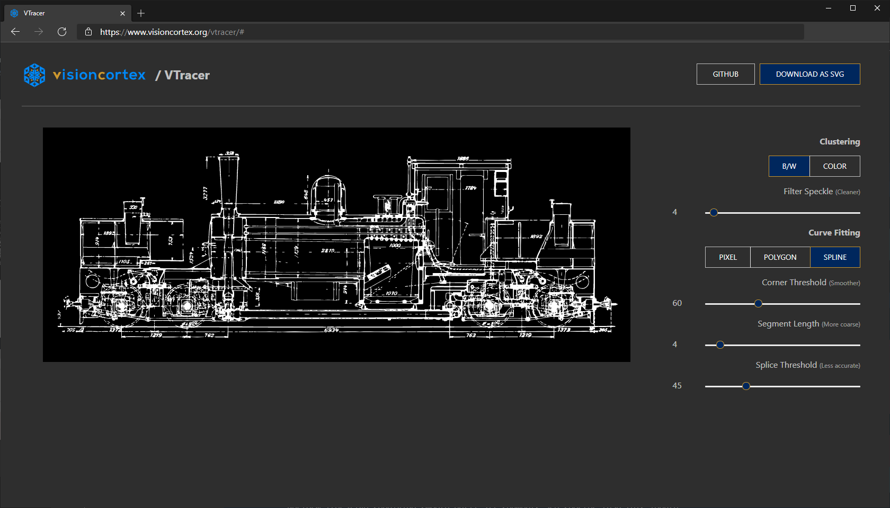
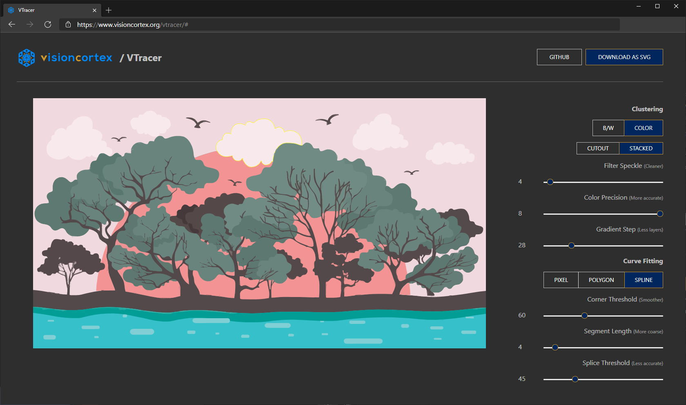

<div align="center">

  
  <h1>VTracer</h1>

  <p>
    <strong>位图转矢量图转换器</strong>
  </p>

  <h3>
    <a href="https://www.visioncortex.org/vtracer-docs">算法文档</a>
    <span> | </span>
    <a href="https://www.visioncortex.org/vtracer/">在线 Web 应用</a>
    <span> | </span>
    <a href="https://github.com/visioncortex/vtracer/releases">下载发布版</a>
  </h3>

</div>

## 项目简介

`visioncortex VTracer` 是一个开源工具，用于将位图图像（如 `jpg/png`）转换为矢量图（`svg`）。

相比只支持黑白二值输入的 Potrace，VTracer 提供了可处理彩色图像的处理流程；同时，VTracer 在输出形状数量与文件体积上通常更紧凑。

该项目最初用于处理高分辨率蓝图扫描，也可用于低分辨率像素风素材。

算法说明：
- 路径追踪算法：https://www.visioncortex.org/vtracer-docs
- 聚类算法：https://www.visioncortex.org/impression-docs

## Web 应用

VTracer 核心由 Rust 实现，并通过 wasm 提供 Web 交互能力。




Web 发布流程说明：
- 前端源码目录：`webapp/app`
- 发布产物目录：`docs`（由构建同步生成，不直接手改业务逻辑）
- 一键构建同步命令：`powershell -NoProfile -ExecutionPolicy Bypass -File .\scripts\build-sync-web-docs.ps1`

## 桌面 E2E 门禁策略（并行双链路）

- 保留现有 WebDriver 链路：`desktopapp/e2e/http-desktop-e2e.js`
- 新增 CDP-Playwright 链路：`desktopapp/e2e/cdp-playwright-e2e.js`
- `http-session-probe` 作为 CI 必过项（立即生效）
- 完整桌面 E2E（WebDriver + CDP）先灰度 1 周，到 `2026-05-28T00:00:00Z` 后自动转为必过

对应 CI 工作流见：`.github/workflows/rust.yml`

## 命令行工具（Cmd App）

```sh
visioncortex VTracer 0.6.12
一个将图像转换为矢量图的命令行工具。

USAGE:
    vtracer [OPTIONS] --input <input> --output <output>
```

常用参数：
- `--input/-i` 输入图片路径
- `--output/-o` 输出 SVG 路径
- `--colormode` 颜色模式：`color` 或 `bw`
- `--mode/-m` 曲线模式：`pixel` / `polygon` / `spline`
- `--preset` 预设：`bw` / `poster` / `photo`

## 安装

### 下载已编译版本

从 Releases 页面下载：
https://github.com/visioncortex/vtracer/releases

### 从 Rust 安装

```sh
cargo install vtracer
```

### 快速使用

```sh
./vtracer --input input.jpg --output output.svg
```

## 作为 Rust 库使用

```sh
cargo add vtracer
```

## 作为 Python 包使用

当前 Python 包版本为 `0.6.15`（基于 pyo3）：

```sh
pip install vtracer
```

## 版本来源说明

- CLI/Rust 版本以 [`cmdapp/Cargo.toml`](cmdapp/Cargo.toml) 为准（当前 `0.6.12`）。
- Python 包版本以 [`cmdapp/pyproject.toml`](cmdapp/pyproject.toml) 为准（当前 `0.6.15`）。
- 两者可独立发布，版本号不同步属于正常情况。

## 引用与相关工作

本项目已被多篇图形学/视觉研究论文引用，详情可见原始仓库说明与链接。
